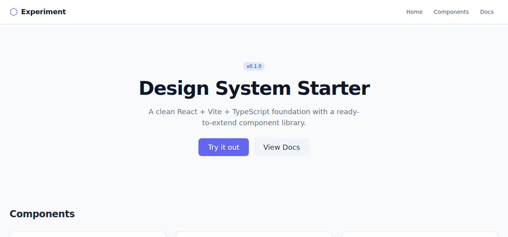
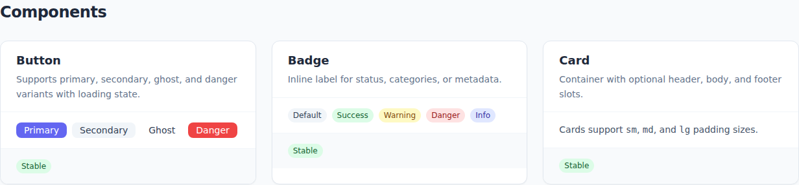

# Experiment

A React + Vite + TypeScript design system starter with a living component catalogue.

[](https://github.com/tophymastery/Experiment/actions/workflows/deploy.yml)

**Live site → [tophymastery.github.io/Experiment](https://tophymastery.github.io/Experiment/)**

---

## Screenshots

| Hero | Components |
|------|-----------|
|  |  |

---

## Quick start

```bash
npm install
npm run dev        # http://localhost:3000
```

## All commands

| Command | Description |
|---------|-------------|
| `npm run dev` | Start local dev server on http://localhost:3000 |
| `npm run build` | Type-check + production build to `dist/` |
| `npm run preview` | Serve the production build locally |
| `npm run type-check` | TypeScript check without emitting |
| `npm run lint` | ESLint across `src/` |

## Stack

| Layer | Tool |
|-------|------|
| Framework | React 18 |
| Bundler | Vite 5 |
| Language | TypeScript 5 (strict) |
| Styling | CSS Modules + design tokens |
| Deploy | GitHub Pages via GitHub Actions |

## Project structure

```
src/
├── components/
│   ├── ui/           # Design system primitives
│   │   ├── Button    # primary / secondary / ghost / danger, loading state
│   │   ├── Card      # header + body + footer slots, sm/md/lg padding
│   │   └── Badge     # default / success / warning / danger / info
│   └── layout/
│       ├── AppLayout # root shell with header + footer
│       └── Header    # sticky nav bar
├── pages/
│   └── Home          # living component catalogue
└── styles/
    └── globals.css   # CSS custom-property design tokens + reset
```

## Adding a component

1. Create `src/components/ui/MyComponent.tsx` + `MyComponent.module.css`
2. Use design tokens (CSS custom properties) — no raw values
3. Export from `src/components/ui/index.ts`
4. Add a demo card in `src/pages/Home.tsx`

## Deployment

Every push to `main` triggers the [deploy workflow](.github/workflows/deploy.yml):

1. `npm ci` — install locked deps
2. `npm run type-check` — fail fast on type errors
3. `npm run build` — Vite production build with `VITE_BASE_PATH=/Experiment/`
4. Publish `dist/` to GitHub Pages via OIDC (no tokens needed)

To enable GitHub Pages for your fork: **Settings → Pages → Source → GitHub Actions**.
